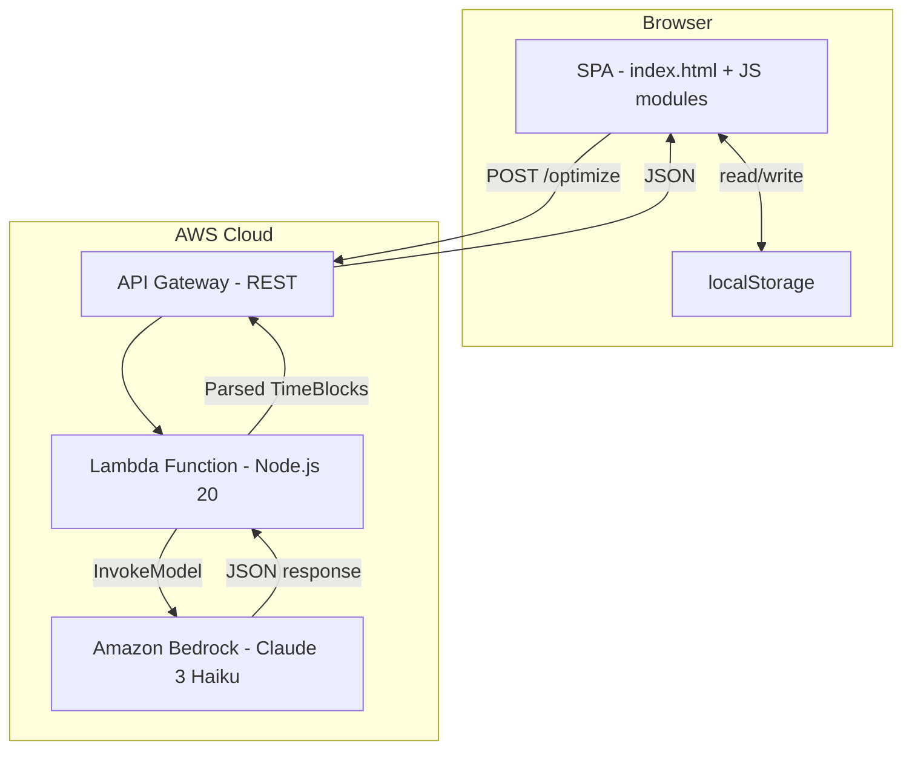
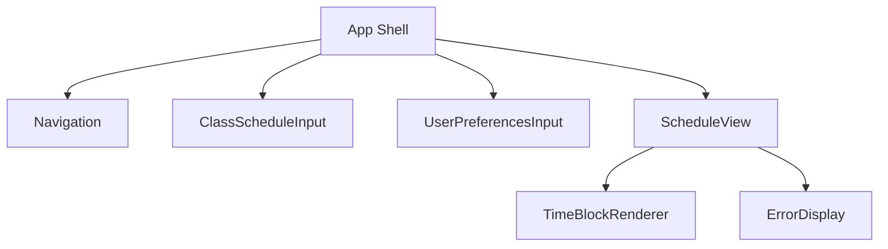

# Design Document: AI Schedule Optimizer

## Overview

The AI Schedule Optimizer is a single-page web application that helps university students optimize free time between classes. It accepts a class schedule and user preferences, sends them to AWS Bedrock via a serverless backend, and displays an AI-generated time-blocked schedule with meals, activities, and transit allocations.

**Architecture Style:** Single-page application (vanilla JavaScript frontend) backed by a serverless AWS API (API Gateway + Lambda + Bedrock). This approach aligns with the existing `index.html` root and avoids introducing a heavy framework for what is fundamentally a form-driven AI interaction app.

**Key Design Decisions:**
- **Vanilla JS + Web Components** for the frontend — keeps the build toolchain minimal, works from a single HTML entry point, and avoids framework lock-in for a focused feature set.
- **localStorage** for client-side persistence of class schedules and preferences (Requirement 1.4, 2.4) — no user auth system is specified, so browser-local storage is the simplest compliant option.
- **AWS Lambda behind API Gateway** for the backend — provides a secure proxy to Bedrock without exposing credentials client-side, handles prompt construction, and enforces rate limits.
- **Structured JSON prompt/response contract** with Bedrock — ensures deterministic parsing and enables round-trip validation (Requirement 3.4).

## Architecture



### Frontend Layer
- Single `index.html` entry point loading ES modules
- Responsible for: class schedule input, preferences UI, schedule display, local persistence
- Communicates with backend via a single REST endpoint

### Backend Layer (Serverless)
- **API Gateway**: Exposes `POST /optimize` endpoint with request validation and CORS
- **Lambda Function**: Constructs the Bedrock prompt from input, invokes the model, parses and validates the response, returns structured TimeBlocks
- **Bedrock**: Generates optimized schedule suggestions using Claude 3 Haiku (cost-effective, fast for structured outputs)

### Data Flow
1. User enters class schedule and preferences → stored in localStorage
2. User clicks "Generate Schedule" for a specific day
3. Frontend sends POST request with class schedule, preferences, campus locations
4. Lambda constructs prompt, calls Bedrock, parses response into TimeBlocks
5. Lambda validates TimeBlocks (no overlaps, within gaps, proper types)
6. Frontend receives TimeBlocks and renders the visual schedule

## Components and Interfaces

### Frontend Components



| Component | Responsibility |
|-----------|---------------|
| **App Shell** | Layout container, routing between views, responsive breakpoints |
| **Navigation** | Day selector tabs, hamburger menu on mobile (Req 8.3, 8.4) |
| **ClassScheduleInput** | Form for adding/editing classes with validation (Req 1) |
| **UserPreferencesInput** | Activity ranking, dietary restrictions selection (Req 2) |
| **ScheduleView** | Orchestrates schedule display, loading states, error handling |
| **TimeBlockRenderer** | Renders individual time blocks with color coding and proportional heights (Req 7) |
| **ErrorDisplay** | Shows API errors, timeout messages, retry button (Req 9) |

### Backend API Interface

#### `POST /optimize`

**Request Body:**
```json
{
  "day": "monday",
  "classes": [
    {
      "name": "Calculus 101",
      "day": "monday",
      "startTime": "09:00",
      "endTime": "10:30",
      "location": "Math Building Room 201"
    }
  ],
  "preferences": {
    "activities": ["study", "exercise", "social"],
    "dietaryRestrictions": ["vegetarian"],
    "mealPreferences": ["lunch", "snack"]
  },
  "regenerationSeed": 1
}
```

**Response Body (Success):**
```json
{
  "day": "monday",
  "timeBlocks": [
    {
      "startTime": "10:30",
      "endTime": "10:40",
      "type": "transit",
      "name": "Walk to Library",
      "location": "University Library"
    },
    {
      "startTime": "10:40",
      "endTime": "11:30",
      "type": "activity",
      "name": "Study Session",
      "location": "University Library"
    },
    {
      "startTime": "11:30",
      "endTime": "12:15",
      "type": "meal",
      "name": "Lunch - Vegetarian Bowl",
      "location": "Student Center Cafeteria"
    }
  ]
}
```

**Response Body (Error):**
```json
{
  "error": {
    "code": "BEDROCK_TIMEOUT" | "BEDROCK_ERROR" | "PARSE_ERROR",
    "message": "Human-readable error message"
  }
}
```

### Frontend Module Structure

```
/js
  /models        - Data classes (Class, TimeBlock, UserPreferences, Schedule)
  /services      - API client, localStorage service
  /components    - UI components (class-input, preferences, schedule-view)
  /validators    - Input validation logic (overlap detection, time validation)
  /utils         - Time math, formatting helpers
```

## Data Models

### Class
```typescript
interface Class {
  id: string;               // UUID, generated client-side
  name: string;             // 1-100 characters
  day: DayOfWeek;           // 'monday' | 'tuesday' | ... | 'friday'
  startTime: TimeValue;     // HH:mm format, 5-min increments, 06:00-23:00
  endTime: TimeValue;       // HH:mm format, must be > startTime
  location: string;         // Campus location name
}

type DayOfWeek = 'monday' | 'tuesday' | 'wednesday' | 'thursday' | 'friday';
type TimeValue = string;    // "HH:mm" format
```

### TimeBlock
```typescript
interface TimeBlock {
  startTime: TimeValue;
  endTime: TimeValue;
  type: BlockType;
  name: string;
  location: string;
}

type BlockType = 'class' | 'transit' | 'meal' | 'activity';
```

### UserPreferences
```typescript
interface UserPreferences {
  activities: ActivityCategory[];  // Ordered by rank (index 0 = highest)
  dietaryRestrictions: DietaryRestriction[];
  mealPreferences: MealType[];
}

type ActivityCategory = 'study' | 'exercise' | 'social' | 'relaxation' | 'errands';
type DietaryRestriction = 'vegetarian' | 'vegan' | 'gluten-free' | 'nut-free' | 'dairy-free' | 'halal' | 'kosher' | 'none';
type MealType = 'breakfast' | 'lunch' | 'dinner' | 'snack';
```

### Schedule (Generated Output)
```typescript
interface Schedule {
  day: DayOfWeek;
  timeBlocks: TimeBlock[];  // Chronologically ordered
  generatedAt: string;      // ISO timestamp
  seed: number;             // Regeneration seed used
}
```

### StoredState (localStorage)
```typescript
interface StoredState {
  classes: Class[];           // Max 30
  preferences: UserPreferences;
  schedules: Record<DayOfWeek, Schedule | null>;
  regenerationCounts: Record<string, number>;  // key: "day-gapIndex", max 5
}
```

### Validation Rules (encoded in validators)
| Rule | Source |
|------|--------|
| Class name: 1-100 chars | Req 1.1 |
| Time in 5-min increments, 06:00-23:00 | Req 1.1 |
| End time > Start time | Req 1.5 |
| No same-day overlaps | Req 1.2 |
| Max 30 classes | Req 1.6 |
| At least 1 activity preference for generation | Req 2.5 |
| Time gaps ≥ 15 min for any block | Req 3.3 |
| Transit: 5-30 min | Req 4.2 |
| Meal blocks ≥ 30 min (or 10-29 for snack) | Req 5.1-5.6 |
| Activity blocks ≥ 15 min | Req 6.2 |

## Bedrock Prompt Engineering

### Prompt Strategy

The Lambda function constructs a structured prompt that constrains the AI's output to a parseable JSON format while giving it freedom to be creative in activity suggestions.

**System Prompt:**
```
You are a university schedule optimization assistant. Given a student's class 
schedule, campus locations, and preferences, generate time-blocked suggestions 
for their free time. 

RULES:
- Only generate blocks within provided time gaps
- Account for transit time between different locations (5-30 minutes)
- Suggest meals during appropriate windows (breakfast 7-10AM, lunch 11AM-2PM, dinner 5-8PM)
- Prioritize activity categories in the order provided by the user
- Vary activity categories across gaps when possible
- Respect dietary restrictions for meal suggestions
- Never overlap with existing classes
- Minimum block durations: transit 5min, meal 30min (10min for snack), activity 15min

OUTPUT FORMAT: Return ONLY a JSON array of time blocks. No commentary.
```

**User Prompt Template:**
```
Day: {day}
Classes: {JSON array of classes for this day}
Free time gaps: {computed gaps with durations}
Activity preferences (ranked): {ordered list}
Dietary restrictions: {list}
Meal preferences: {list}
Randomization seed: {seed}

Generate an optimized schedule for the free time gaps.
```

### Response Parsing

The Lambda performs strict parsing:
1. Extract JSON array from response
2. Validate each block has required fields (startTime, endTime, type, name, location)
3. Validate block types are one of: transit, meal, activity
4. Validate chronological ordering
5. Validate no overlaps with classes or between blocks
6. Validate blocks fit within computed time gaps
7. If validation fails on any block, exclude that block but include valid ones (Req 3.5)

## Error Handling

### Frontend Error Handling

| Error Scenario | User Experience | Recovery |
|---------------|----------------|----------|
| Bedrock API error (500) | Error message in schedule area: "Service temporarily unavailable" | Retry button (Req 9.1) |
| Request timeout (30s) | Timeout message: "Request took too long" | Retry button (Req 9.2) |
| Parse failure | Message: "Schedule could not be generated" | Retry button (Req 9.3) |
| Network offline | Message: "No internet connection" | Auto-retry on reconnect |
| Validation error (class overlap) | Inline error on form identifying conflicts | User fixes input (Req 1.3) |
| End time ≤ start time | Inline error on class form | User corrects time (Req 1.5) |

### Error State Management (Req 9.4, 9.5)
- On any API error: hide loading indicators within 2 seconds
- Preserve all user inputs (class schedule, preferences) in localStorage
- Return UI to pre-request state (form still accessible)
- Error message persists until user dismisses or initiates new request

### Backend Error Handling

| Error Scenario | Lambda Behavior | Response |
|---------------|----------------|----------|
| Bedrock InvokeModel failure | Log error, return structured error | `{ error: { code: "BEDROCK_ERROR", message: "..." } }` |
| Bedrock timeout | Abort after 25s (leaving 5s for Lambda cleanup) | `{ error: { code: "BEDROCK_TIMEOUT", message: "..." } }` |
| Invalid JSON from Bedrock | Log raw response, return error | `{ error: { code: "PARSE_ERROR", message: "..." } }` |
| Partial valid response | Return valid blocks only | Normal response with subset of blocks |
| Invalid request body | Reject at API Gateway | 400 with validation details |

### Retry Strategy
- Client-side: User-initiated retry only (no automatic retry to avoid duplicate Bedrock calls)
- Each retry uses an incremented regeneration seed
- Regeneration limit: 5 per day per time gap (Req 10.3)

## Correctness Properties

*A property is a characteristic or behavior that should hold true across all valid executions of a system — essentially, a formal statement about what the system should do. Properties serve as the bridge between human-readable specifications and machine-verifiable correctness guarantees.*

### Property 1: Class input validation

*For any* string `name` and time pair `(startTime, endTime)` with a day and location: the class is accepted if and only if `name` has 1-100 characters, `startTime` and `endTime` are 5-minute increments between 06:00 and 23:00, and `endTime > startTime`.

**Validates: Requirements 1.1, 1.5**

### Property 2: Overlap detection correctness

*For any* set of classes on the same day, the overlap validator reports a conflict between two classes if and only if one class's start time is before the other's end time AND its end time is after the other's start time.

**Validates: Requirements 1.2**

### Property 3: Stored state round-trip

*For any* valid `StoredState` (class schedule + user preferences), serializing to localStorage and deserializing back produces an identical object.

**Validates: Requirements 1.4, 2.3, 2.4**

### Property 4: TimeBlock parse/format round-trip

*For any* valid list of TimeBlocks, formatting them to the Bedrock response JSON format and parsing that JSON back produces a schedule with identical block ordering, start times, end times, and block types.

**Validates: Requirements 3.4**

### Property 5: TimeBlocks confined to time gaps

*For any* class schedule and generated set of TimeBlocks, every TimeBlock falls entirely within an identified time gap (≥ 15 minutes) and no TimeBlock overlaps with any class.

**Validates: Requirements 3.3**

### Property 6: Chronological ordering

*For any* generated schedule, the TimeBlocks are ordered such that for consecutive blocks `b[i]` and `b[i+1]`, `b[i].startTime <= b[i+1].startTime`.

**Validates: Requirements 3.2, 7.3**

### Property 7: Transit block insertion and bounds

*For any* generated schedule where consecutive activities are at different campus locations, a Transit_Block exists between them with a duration between 5 and 30 minutes inclusive, and no Activity_Block or Meal_Block ends later than the start of a required Transit_Block.

**Validates: Requirements 4.1, 4.2, 4.3**

### Property 8: Gap consumed by transit when insufficient

*For any* time gap between classes at different locations where the gap duration is less than or equal to the required transit duration, the entire gap is allocated as a single Transit_Block with no other blocks present.

**Validates: Requirements 4.4**

### Property 9: Meal block timing rules

*For any* time gap within a meal window: if the gap is ≥ 30 minutes in breakfast (7-10AM), lunch (11AM-2PM), or dinner (5-8PM) windows, a Meal_Block is suggested with duration equal to min(gap, cap) where cap is 60 min for breakfast/lunch and 90 min for dinner; if the gap is 10-29 minutes in a meal window, a snack is suggested with duration equal to the gap; if the gap is < 10 minutes in a meal window, no Meal_Block is generated.

**Validates: Requirements 5.1, 5.2, 5.3, 5.5, 5.6**

### Property 10: One meal per window per day

*For any* generated schedule for a single day, there is at most one Meal_Block in each meal window (breakfast, lunch, dinner).

**Validates: Requirements 5.7**

### Property 11: Meal blocks respect dietary restrictions

*For any* generated Meal_Block and user with dietary restrictions, the meal suggestion does not include items from restricted categories.

**Validates: Requirements 5.4**

### Property 12: Activity blocks respect duration and preference constraints

*For any* generated Activity_Block, its duration is at least 15 minutes, fits within the available gap minus required transit time, and its category is one of the user's selected preference categories.

**Validates: Requirements 6.1, 6.2, 6.4**

### Property 13: Activity category prioritization

*For any* generated schedule with multiple Activity_Blocks and multiple user preference categories, activities matching higher-ranked preference categories appear before lower-ranked ones when gaps of equal suitability are available.

**Validates: Requirements 6.3**

### Property 14: Activity category variety

*For any* generated schedule with multiple Activity_Blocks across different time gaps on the same day (and more than one preference category selected), no two consecutive Activity_Blocks have the same category.

**Validates: Requirements 6.5**

### Property 15: Error state preserves inputs

*For any* API error (timeout, service error, parse failure), the stored class schedule and user preferences remain unchanged after error handling completes.

**Validates: Requirements 9.4**

## Testing Strategy

### Unit Tests

**Framework:** Vitest (lightweight, fast, ESM-native)

**Coverage Areas:**
- **Validators**: Class overlap detection, time validation, preference validation
- **Time utilities**: Gap computation, duration calculation, time formatting
- **Response parser**: TimeBlock extraction, validation, partial response handling
- **Data models**: Serialization/deserialization to localStorage
- **Meal logic**: Meal window detection, duration capping, dietary filtering
- **Transit logic**: Duration calculation, gap consumption rules

### Property-Based Tests

**Framework:** fast-check (JavaScript property-based testing library)

Property-based testing is appropriate for this feature because:
- Schedule validation involves pure functions with clear input/output behavior
- The input space is large (many class combinations, time values, preference orderings)
- Universal properties exist (no overlaps, round-trips, time ordering invariants)
- Core logic (gap computation, overlap detection, block validation) is algorithmic

**Configuration:**
- Minimum 100 iterations per property test
- Each property test references its design document property via tag comment
- Tag format: `// Feature: ai-schedule-optimizer, Property {N}: {title}`
- Each correctness property (1-15) maps to a single property-based test
- Generators produce: random valid classes, time values (5-min increments), preference orderings, TimeBlock lists, and StoredState objects

### Integration Tests

- Lambda + Bedrock integration (mocked Bedrock responses)
- API Gateway request validation
- End-to-end flow with sample schedules

### Visual/Manual Tests

- Responsive layout verification across viewport sizes (320px - 1920px)
- Color contrast and accessibility checks
- Touch target size verification on mobile

